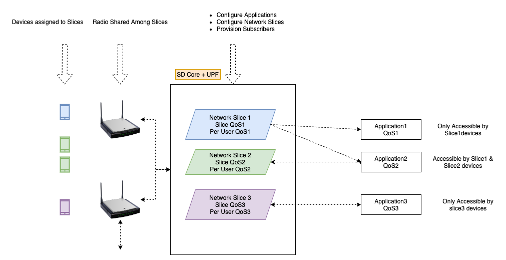

..
   SPDX-FileCopyrightText: © 2020 Open Networking Foundation <support@opennetworking.org>
   SPDX-License-Identifier: Apache-2.0

.. _application-filtering:

Application Filtering Overview
==============================

Below config snapshot shows how to configure application filtering in the network slice.
Each application filter in the network slice can have action either ``permit`` or ``deny``

.. code-block::

  config:
    simapp:
      cfgFiles:
        simapp.yaml:
          configuration:
            provision-network-slice: true
            sub-provision-endpt:
              addr: config4g
              port: 5000
            subscribers:
            - ueId-start: 208014567891201
              ueId-end: 208014567891211
              plmnId: 20801
              opc: "d4416644f6154936193433dd20a0ace0"
              op: ""
              key: "465b5ce8b199b49faa5f0a2ee238a6bc"
              sequenceNumber: 96
            device-groups:
            - name:  "4g-oaisim-user"
              imsis:
                - "208014567891201"
                - "208014567891202"
              ip-domain-name: "pool1"
              ip-domain-expanded:
                dnn: internet
                dns-primary: "8.8.8.8"
                mtu: 1460
                ue-ip-pool: "172.250.0.0/16"
                ue-dnn-qos:
                  dnn-mbr-downlink: 20000000
                  dnn-mbr-uplink: 4000000
                  bitrate-unit: bps
                  traffic-class:  #default bearer QCI/ARP
                    name: "platinum"
                    qci: 9
                    arp: 1
                    pdb: 300
                    pelr: 6
              site-info: "aiab"

            network-slices:
            - name: "default"
              slice-id:
                sd: "010203"
                sst: 1
              site-device-group:
              - "4g-oaisim-user"
              application-filtering-rules:
              - rule-name: "deny-private1"
                priority: 250
                action: permit
                endpoint: "10.0.0.0/8"
                protocol: 6
                dest-port-start: 20005
                dest-port-end : 20005
                traffic-class:
                  name: “platinum”
                  qci: 9
                  arp: 1
                  pdb: 300
                  pelr: 6
              - rule-name: “deny-private-2”
                priority: 251
                action : permit
                endpoint: "172.16.0.0/16"
                protocol: 6
                dest-port-start: 20005
                dest-port-end : 20005
                traffic-class:
                  name: “platinum”
                  qci: 9
                  arp: 1
                  pdb: 300
                  pelr: 6
              site-info:
                gNodeBs:
                - name: "aiab-gnb1"
                  tac: 1
                plmn:
                  mcc: "208"
                  mnc: "01"
                site-name: "aiab"
                upf:
                  upf-name: "upf"
                  upf-port: 8805
