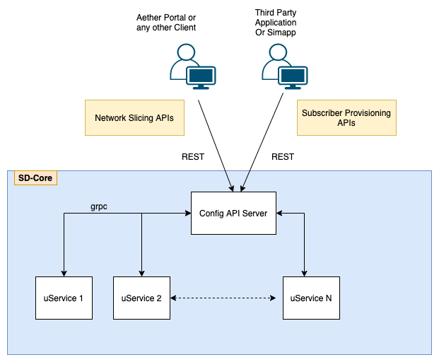

..
   SPDX-FileCopyrightText: © 2020 Open Networking Foundation <support@opennetworking.org>
   SPDX-License-Identifier: Apache-2.0

Configuration Overview
======================

SD-Core has been developed with a cloud-based deployment and consumption model as
its foundation. It has a rich and extensible set of APIs to allow for runtime configurability of
subscriber management, access management, session management, and network slice
management. This configuration may be conducted via ONF’s Runtime Operational Control
(ROC) platform directly for consumption as a cloud-managed service, or the APIs can be
used by third-party automation and management platforms.

Reference helm chart
--------------------

    - `SD-Core Helm Chart Repository <https://gerrit.opencord.org/admin/repos/sdcore-helm-charts>`_
    - Sub components in sdcore-helm-charts

        - omec-control-plane: 4G Network functions helm charts
        - 5g-control-plane: 5G Network functions helm charts
        - omec-sub-provision: Simapp helm charts
        - 5g-ran-sim : gNBSim helm charts

Configuration Methods
---------------------
SD-Core supports 2 ways to configure network functions and micro services.

    - Helm Chart

        - Each individual network function and microservice has its own helm chart.
        - User needs to provide override values and deploy the network functions as per their need.
        - Use above helm charts appropriately and provide override values and install 4G/5G NFs.

    - REST Config Interface

        - Basic static configuration is still passed through helm chart ( logging level, image,...)
        - Dynamic *Network Slice* management  APIs are provided through REST interface.
        - REST APIs are defined to create/modify/delete network slice.
        - REST APIs are also provided to provision subscribers and grouping the subscribers under device Group.

.. note::
        - Simapp is the example of REST interface based configuration to provision subscribers in SD-Core
        - Simapp is also used to provision Network Slices in SD-Core in the absence of Portal
        - Aether ROC Portal used REST interface to configure Network Slices in SD-Core

Configuration Steps
-------------------
This Configuration describes what to configure at high level from RoC/SIMAPP. ConfigPod stores this configuration
and publish to respective clients over REST/grpc.

    - Step1 : Provision subscriber in 4G/5G subsystem

        - *Can be done only through SIMAPP*
        - This step is used to configure IMSI in the SD-Core
        - This procedure is used to configure security keys for a subscriber
        - Subscribers can be created during system startup or later

    - Step2 : Device Group Configuration

        - Group multiple devices under device group
        - Configure QoS for the device group
        - Configure IP domain configuration for the device group e.g. MTU, IP Pool, DNS server

    - Step3: Network Slice Configuration

        - Configuration to create a Network Slice
        - Add device Group into Network Slice
        - Slice contains the Slice level QoS configuration
        - Site configuration including UPF, eNBs/gNBs assigned to the slice
        - Applications allowed to be accessed by this slice (see :ref:`application-filtering`)

.. note::
        - Step1 can only be done through Simapp. Look for simapp override values.
        - Step2 & Step3 can be done through Simapp or ROC. Simapp has option to create network slice. Look for configuration *provision-network-slice: false* in simapp configuration

.. note::
   If UPF is used to allocate UE address allocation then even if you have specified UE
   address pool in the slice config, you still need to add the address pool
   configuration in the UPF deployment.

4G, 5G Configuration Differences
--------------------------------
One of the most important difference in 4G & 5G configuration is around network slice. 5G has
network slice Ids sent on 3gpp defined protocol messages whereas 4G does not have any slice Id in
3gpp defined protocol messages. We implement slicing in 4G using APNs. Let's go over these
difference in detail below,

- **Slice Id** : Since 4G does not have slice Id in any protocol messages, configured slice Ids
  are ignored in 4G components. So it also means that even if configured slice Ids are
  duplicate it will not have any impact. But its still a good practice to have unique Slice
  Id per slice.

- **APN/DNN configuration**: In case of 4G each slice should have separate APN. This is required
  because APN is used as slice identifier internally in the 4G modules. This is not true in
  case of 5G because 5G has slice Id along with APN/DNN. So in general its good practice to
  keep APN/DNN in the slice unique so same slice can work for 4G & 5G configuration.

- **DNN/APN in Initial Attach/Register Message** : In case of 4G, if UE has set any random APN then
  MME overrides the APN based on the user profile in HSS. So its important to note that even if APN
  is not matching with configured APN we are still good.  In case of 5G, apn name & Slice ID coming
  from UE is used to select SMF, so its important to have UE configured with correct APN/DNN name.
  Core network passed allowed slice IDs to UE in the registration accept message.
