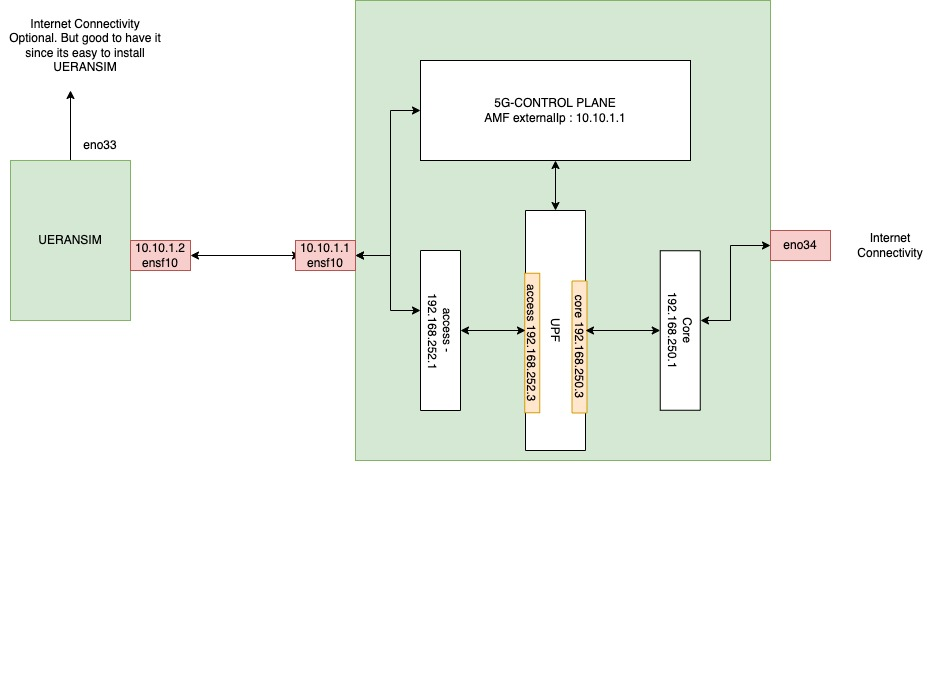

..
   SPDX-FileCopyrightText: © 2022 Open Networking Foundation <support@opennetworking.org>
   SPDX-License-Identifier: Apache-2.0

.. _deployment_ueransim_guide:

UERANSIM Deployment Guide
==========================

Network Setup
'''''''''''''

SD-Core VM Preparation
'''''''''''''''''''''''

- To Expose External IP and Port of amf service, update sd-core-5g-values.yaml ::

     amf:
       # use externalIP if you need to access your AMF from remote setup and you don't
       # want setup NodePort Service Type
       ngapp:
         externalIp: 10.10.1.1 #ip address of DATA_IFACE
         port: 38412

- Deploy 5g core with options DATA_IFACE=ens1f0 and ENABLE_GNBSIM=false, sample command::

     $ ENABLE_GNBSIM=false DATA_IFACE=ens1f0 CHARTS=release-2.0 make 5g-core

- Make sure that ``DATA_IFACE`` connected  with UERANSIM VM

UERANSIM VM Preparation
'''''''''''''''''''''''

- Single interface is used for user plane traffic towards UPF and also control plane
  traffic towards AMF

- Add following route in routing table for sending traffic over ``DATA_IFACE`` interface ::

     $ ip route add 192.168.252.3 via 10.10.1.1

- Changes done on UERANSIM to match config with above network topology::

      diff --git a/config/free5gc-gnb.yaml b/config/free5gc-gnb.yaml
      index 81bb13b..452ccad 100644
      --- a/config/free5gc-gnb.yaml
      +++ b/config/free5gc-gnb.yaml
      @@ -5,13 +5,13 @@ nci: '0x000000010'  # NR Cell Identity (36-bit)
       idLength: 32        # NR gNB ID length in bits [22...32]
       tac: 1              # Tracking Area Code

      -linkIp: 127.0.0.1   # gNB's local IP address for Radio Link Simulation (Usually same with local IP)
      -ngapIp: 127.0.0.1   # gNB's local IP address for N2 Interface (Usually same with local IP)
      -gtpIp: 127.0.0.1    # gNB's local IP address for N3 Interface (Usually same with local IP)
      +linkIp: 10.10.1.2   # gNB's local IP address for Radio Link Simulation (Usually same with local IP)
      +ngapIp: 10.10.1.2   # gNB's local IP address for N2 Interface (Usually same with local IP)
      +gtpIp: 10.10.1.2    # gNB's local IP address for N3 Interface (Usually same with local IP)

       # List of AMF address information
       amfConfigs:
      -  - address: 127.0.0.1
      +  - address: 10.10.1.1
           port: 38412

       # List of supported S-NSSAIs by this gNB
      diff --git a/config/free5gc-ue.yaml b/config/free5gc-ue.yaml
      index 9089ba0..aa0df2e 100644
      --- a/config/free5gc-ue.yaml
      +++ b/config/free5gc-ue.yaml
      @@ -1,14 +1,14 @@
       # IMSI number of the UE. IMSI = [MCC|MNC|MSISDN] (In total 15 digits)
      -supi: 'imsi-208930000000003'
      +supi: 'imsi-208930100007509'
       # Mobile Country Code value of HPLMN
       mcc: '208'
       # Mobile Network Code value of HPLMN (2 or 3 digits)
       mnc: '93'

       # Permanent subscription key
      -key: '8baf473f2f8fd09487cccbd7097c6862'
      +key: '5122250214c33e723a5dd523fc145fc0'
       # Operator code (OP or OPC) of the UE
      -op: '8e27b6af0e692e750f32667a3b14605d'
      +op: '981d464c7c52eb6e5036234984ad0bcf'
       # This value specifies the OP type and it can be either 'OP' or 'OPC'
       opType: 'OPC'
       # Authentication Management Field (AMF) value
      @@ -20,7 +20,7 @@ imeiSv: '4370816125816151'

       # List of gNB IP addresses for Radio Link Simulation
       gnbSearchList:
      -  - 127.0.0.1
      +  - 10.10.1.2

       # UAC Access Identities Configuration
       uacAic:
      @@ -57,14 +57,14 @@ default-nssai:
       # Supported integrity algorithms by this UE
       integrity:
         IA1: true
      -  IA2: true
      -  IA3: true
      +  IA2: false
      +  IA3: false

       # Supported encryption algorithms by this UE
       ciphering:
      -  EA1: true
      -  EA2: true
      -  EA3: true
      +  EA1: false
      +  EA2: false
      +  EA3: false

       # Integrity protection maximum data rate for user plane
       integrityMaxRate:

- Once UE is connected to 5G NetwChanges done on UERANSIM to match config with above network topology::

   node1:~ ifconfig uesimtun0

   uesimtun0: flags=369<UP,POINTOPOINT,NOTRAILERS,RUNNING,PROMISC>  mtu 1400
           inet 172.250.237.124  netmask 255.255.255.255  destination 172.250.237.124
           inet6 fe80::2697:29c8:d043:cf35  prefixlen 64  scopeid 0x20<link>
           unspec 00-00-00-00-00-00-00-00-00-00-00-00-00-00-00-00  txqueuelen 500  (UNSPEC)
           RX packets 16  bytes 1344 (1.3 KB)
           RX errors 0  dropped 0  overruns 0  frame 0
           TX packets 558  bytes 46516 (46.5 KB)
           TX errors 0  dropped 0 overruns 0  carrier 0  collisions 0

   node1:~$ ping -I uesimtun1 8.8.8.8
   PING 8.8.8.8 (8.8.8.8) from 172.250.237.124 uesimtun1: 56(84) bytes of data.
   64 bytes from 8.8.8.8: icmp_seq=1 ttl=111 time=14.4 ms
   64 bytes from 8.8.8.8: icmp_seq=2 ttl=111 time=14.4 ms
   ^C
   --- 8.8.8.8 ping statistics ---
   2 packets transmitted, 2 received, 0% packet loss, time 1002ms
   rtt min/avg/max/mdev = 14.377/14.380/14.384/0.003 ms
   node1:~$

.. note::
   In above network topology, SD-Core node has iptables NAT rule applied so that
   UE traffic is NATed and reverse traffic is sent to UERANSIM.

   iptables -t nat -A POSTROUTING -o eno34 -j MASQUERADE
