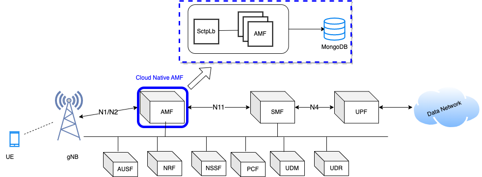

..
   SPDX-FileCopyrightText: © 2020 Open Networking Foundation <support@opennetworking.org>
   SPDX-License-Identifier: Apache-2.0

.. _design_amf:

AMF Design Overview
===================

SctpLb (SctpLoadbalancer)
-------------------------

  * Accept and manage gnb or sctp connections

  * GRPC communication between SctpLb and Amf Service

  * Handles Amf Instance Down/Up Notifications

  * Backend NF manages AMF instances

  * Round-Robin Distribution of Sctp Messages over grpc channel to Backend NF

  * Redirect Support for forwarding to a particular Amf Instance
