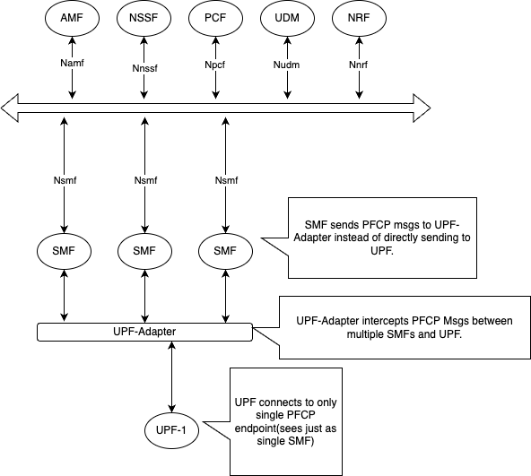

..
   SPDX-FileCopyrightText: © 2020 Open Networking Foundation <support@opennetworking.org>
   SPDX-License-Identifier: Apache-2.0

.. _design_smf:

SMF Design Overview
===================

UPF-Adapter
-----------

As UPF may not support connections from multiple SMF instances with same Node-Id,
UPF-Adapter layer has been introduced.

* UPF-Adapter acts like Mux-Demux for PFCP messages between multiple SMF instances and UPF.

* SMF sends custom PFCP msg to UPF-Adapter if UPF-Adapter is deployed.

* The UPF-Adapter intercepts and modifies certain fields before sending PFCP msg to actual UPF.

* Similar handling is done for the response from UPF towards SMF.

