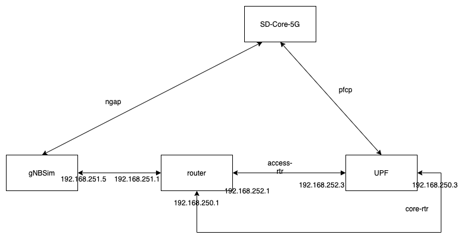

..
   SPDX-FileCopyrightText: © 2020 Open Networking Foundation <support@opennetworking.org>
   SPDX-License-Identifier: Apache-2.0
.. _gNB-Simulator:

gNB Simulator
=============

Description
-----------
The gNBSim tool simulates gNodeB and UE by generating and processing NAS and
NGAP messages for the configured UEs and call flows. The tool currently supports
simulation profiles for the following procedures,

* Registration
* UE Initiated PDU Session Establishment
* UE Initiated De-registration.
* AN Release
* Ue Initiated Service Request Procedure

It is also capable to generate and send user data packets (ICMP echo request)
and process down-link user data (ICMP echo response) over the established data
plane path (N3 Tunnel).

Configure gNBSim
-----------------------
* The config file for gNBSim can be found at *<repo dir>/config/gnbsim.yaml*

    *Note: The configuration has following major fields (Read the comments in
    the config file for more details)*

    * **gnbs**:
        List of gNB's to be simulated. Each item in the list holds configuration
        specific to a gNB.
    * **profiles**:
        List of test/simulation profiles. Each item in the list holds
        configuration specific to a profile.

* Enable or disable a specific profile using the **enable** field.

    *Note: Currently following profiles are supported*

    * **register**:
        Registration procedure
    * **pdusessest** (Default):
        Registration + UE initiated PDU Session Establishment + User Data packets
    * **deregister**:
        Registration + UE initiated PDU Session Establishment + User Data packets
        + Deregister
    * **anrelease**:
        Registration + UE initiated PDU Session Establishment + User Data packets
        + AN Release
    * **uetriggservicereq**:
        Registration + UE initiated PDU Session Establishment + User Data packets
        + AN Release + UE Initiated Service Request

Run gNBSim
-----------
* To quickly launch and test AiaB with 5G SD-CORE using gNBSim:

    .. code-block:: bash

        $ make 5g-test

    (refer AiaB documentation :ref:`aiab-guide`)

* Alternatively, once 5G SD-CORE is up, you can enter into the gNBSim pod by
    running:

    .. code-block:: bash

        $ kubectl exec -it gnbsim-0 -n omec bash

    Then run following command to launch gNBSim:

    .. code-block:: bash

        $ ./gnbsim

    *Note: By default, the gNB Sim reads the configuration from
    /gnbsim/config/gnb.conf file. To provide a different configuration file, use
    the below command*

    .. code-block:: bash

        $ ./gnbsim --cfg <config file path>

Build gNBSim
-------------------

* If you find a need to change gNBSim code and use the updated image in the AIAB setup then
  follow below steps.

* To modify gNBSim and build a new docker image:

    .. code-block:: bash

        $ git clone https://github.com/omec-project/gnbsim.git
        $ cd gnbsim
        $ make docker-build  #requires golang installed on the machine

* To use newly created image in the AiaB cluster:

Update *~/aether-in-box/sd-core-5g-values.yaml* to point to the newly built image, then run:

    .. code-block:: bash

        $ cd ~/aether-in-a-box/
        $ make reset-5g-test

    .. code-block:: bash

        $ make 5g-test

    (refer AiaB documentation :ref:`aiab-guide`)

