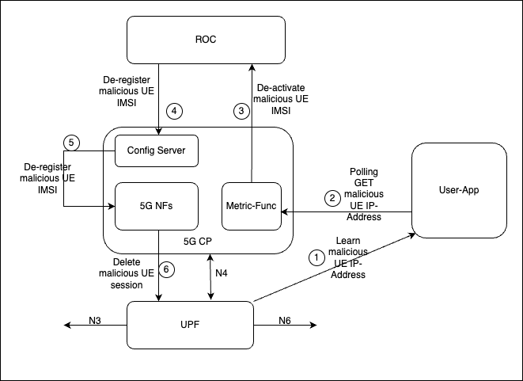

..
   SPDX-FileCopyrightText: 2023-present Intel Corporation
   SPDX-FileCopyrightText: © 2020 Open Networking Foundation <support@opennetworking.org>
   SPDX-License-Identifier: Apache-2.0

.. _rogue-subscriber:

Dynamic Subscription revoking provision
=======================================

This feature enables 5G network to revoke subscription of specific UE.
It is required that user identifies the IP-Address of specific UE to be disabled.
The custom user application can make available the IP-Address of specific UE to 5G
core network via Metric-Function API. The 5G network shall revoke the specific UE’s
subscription based on UE IP-Addresses received.

Following diagram show one such use case of identifying malicious UE and then revoking its subscription from 5G core.

* The UPF shall detect malicious UE IP-Address and the user application shall learn it.
* The user application shall maintain the malicious subscriber's IP Address.
* The Controller functionality of the MetricFunction shall keep polling the user application to fetch malicious
  subscriber's IP
  Address.
* The metricfunc manages all subscriber contexts, so the Controller identifies the IMSI associated to malicious
  Subscriber IP.
* The MetricFunc Pod notifies the ROC to disable the SIM Card associated with malicious subscriber.
* ROC updates the Config Server(webui) with updated Device Group(s) and slice(s) information.
* AMF initiates a network-triggered deregistration procedure to detach the UE from the 5G core.

The Metric-Function configuration to poll the user application

.. code-block::

   userAppApiServer:
     addr: "userapp.omec.svc"
     port: 9301
   rocEndPoint:
     addr: "aether-roc-umbrella-aether-roc-gui-v2-1-external.aether-roc.svc"
     port: 80
