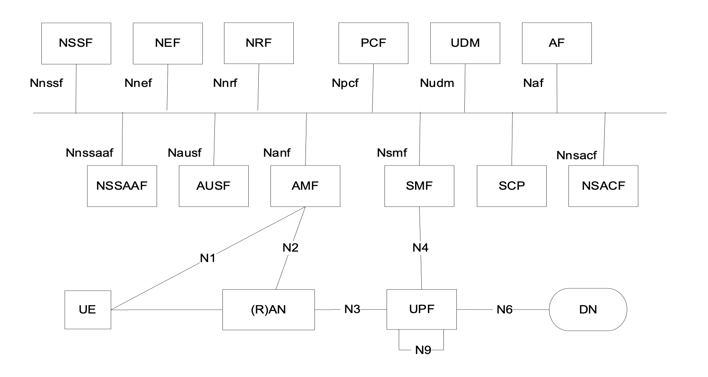

..
   SPDX-FileCopyrightText: © 2020 Open Networking Foundation <support@opennetworking.org>
   SPDX-License-Identifier: Apache-2.0

.. _5g-compliance:

5G - 3GPP Release Compliance
============================

High Level Summary
------------------

* Service based Interfaces supported
    * Nnssf, Nnrf, Npcf, Nudm, Nausf, Namf, Nsmf

* Reference model based Interfaces supported
    * N1, N2, N3, N4, N6, N7, N8, N9, N10, N11, N12, N13, N15, N22

.. image:: ../_static/images/5G_Arch_ reference_model.png
  :width: 700px

* Unified Data Repository (UDR) Interfaces supported
    * N8, N10, N13, N21, N35, N36, N37

* NF supported
    * AMF, NRF, SMF, PCF, UDM, UDR, NSSF, AUSF, N3IWF

* NF not supported
    * NEF, NWDAF, CHF, UDSF, AF

* High Level Features supported
    * UE Registration
    * UE De-Registration
    * PDU Session Establishment/Modification/Release
    * AN Release
    * Network triggered Service Request
    * Xn based inter NG-RAN handover

* High Level Features Not supported
    * Charging Interfaces
    * Lawful Intercept
    * URLLC (Ultra Low Level Latency Communication)
    * Location Based Services
    * Inter NG-RAN node N2 based handover
    * TSN ( Time Sensitive Networking)

SMF Compliance
--------------

* Specifications
   * 23.501
   * 23.502
   * 29.502
   * 29.244 (PFCP)
   * 23.527 - Restoration

* Interfaces
    * SBI : Yes
    * N4(UPF), N7(PCF), N10(UDM), N11(AMF) : Yes
    * N16(SMF) : No

* Services
    * PDU Session Management
    * Event Exposure
    * NIDD

* Service Operations
    * PDU Session Management
        * SM contexts collection
            * Create SM Context : Yes
        * Individual SM context
            * Retrieve SM Context : No
            * Update SM Context : Yes
            * Release SM Context : Yes
            * Notify SM Context Status : Yes
            * Send MO Data : No
        * PDU sessions collection
            * Create : No
        * Individual PDU session
            * Update : No
            * Release : No
            * Notify Status : No
            * Retrieve : No
            * Send MO Data: No
            * Transfer MO Data : No
            * Transfer MT Data : No
    * Event Exposure
        * No
    * NIDD
        * No

* Not supported Features
    * Charging interface
    * 5G VN Group communication

AMF Compliance
--------------
* Specification References
    * 23.501
    * 23.502
    * 29.518 (AMF Services)
    * 29.507 (AMF to PCF interface)

* Interfaces
    * SBI : Yes
    * N11(SMF), N15(PCF), N8(UDM), N12(AUSF), N22(NSSF), N2(AN/NGAP), N1(UE/NAS) : Yes
    * N14(AMF), N58(NSSAAF) : No

* Services
    * Communication
    * Event Exposure
    * Mobile Terminated
    * Location

* Service Operations
    * Communication
        * UE Context Transfer : Yes
        * Registration Status Update : Yes
        * N1N2 Message Transfer (UE Specific) : Yes
        * N1N2 Transfer Failure Notification (UE Specific) : Yes
        * N1N2 Message Subscribe (UE Specific) : Yes
        * N1N2 Message Unsubscribe (UE Specific) : Yes
        * N1 Message Notify (UE Specific) : Yes
        * N2 Info Notify (UE Specific) : Yes
        * Non Ue N2 Message Transfer : No
        * Non Ue N2 Info Subscribe : No
        * Non Ue N2 Info Unsubscribe : No
        * N2 Info Notify : No
        * EBI Assignment : Yes
        * Create UE Context : Yes
        * Release UE Context : Yes
        * Relocate UE Context : No
        * Cancel Relocate UE Context : No
        * AMF Status Change Subscribe : Yes
        * AMF Status Change Unsubscribe : Yes
        * AMF Status Change Notify : Yes
    * Event Exposure
        * Subscribe : Yes
        * Unsubscribe : Yes
        * Notify : Yes
    * Mobile Terminated
        * Enable UE Reachability : No
        * Provide Domain Selection Info : Yes
    * Location
        * Provide Positioning Info : No
        * Event Notify : No
        * Provide Location Info : Yes
        * Cancel Location : No

* Consumer Service Operations
    * PCF
        * AM Policy Control Create : Yes
        * AM Policy Control Delete : Yes
        * AM Policy Control Update : Yes
    * NRF
        *  NF Registration : Yes
        *  NF De-Registration : Yes
        *  NF Selection : Yes
    * SMF
        * Create SM Context : Yes
        * Update SM Context : Yes
        * Release SM Context : Yes
    * AUSF
        * UE Authentication Auth Request : Yes
        * 5G AKA Confirm Request : Yes
        * EAP Auth Confirm Request : Yes
    * UDM
        * UE CM Registration : Yes
        * SDM Subscribe : Yes
        * Get UE Context In SMF Data : Yes
        * Get SMF Selection Data : Yes
        * Get AM Data : Yes
        * Get SliceSelection Data : Yes
    * NSSF
        * Selection Data For Registration : Yes

.. note::
    Interface to EIR not supported. Interface between AMF/AMF not supported. 4G to 5G handover not supported.

NRF Compliance
--------------

* Specifications
   * 29.510

* Interfaces
    * SBI : Yes
    * N27(NRF) : No

* Services
    * NF Management
    * NF Discovery
    * Access Token
    * Bootstrapping

* Service Operations
    * NF Management
        * NF Register : Yes
        * NF Update : Yes
        * NF Deregister : Yes
        * NF Status Subscribe : Yes
        * NF Status Notify : No
        * NF Status Unsubscribe : Yes
        * NF List Retrieval : Yes
        * NF Profile Retrieval : Yes
    * NF Discovery
        * NF Discover : Yes
    * Access Token
        * Access Token Request : Yes
    * Bootstrapping
        * Bootstrapping Get : No

AUSF Compliance
---------------

* Specifications
   * 33.501
   * 29.509

* Interfaces
    * SBI : Yes
    * N12(AMF), N13(UDM) : Yes

* Services
    * UE Authentication
    * SoR Protection
    * UPU Protection

* Service Operations
    * UE Authentication
        * Authenticate : Yes
        * Deregister : No
    * SoR Protection
        * Protect : No
    * UPU Protection
        * Protect : No

UDR Compliance
--------------
* Interfaces
    * SBI : Yes
    * N35(UDM), N36(PCF) : Yes
    * N37(NEF) : No

* Services
    * Data Repository
    * Group IDmap

* Service Operations
    * Subscription Data Repository
        * Query : Yes
        * Create : Yes
        * Delete : Yes
        * Update : Yes
        * Subscribe : Yes
        * Unsubscribe : Yes
        * Notify : Yes
    * Policy Data Repository
        * Query : Yes
        * Create : Yes
        * Delete : Yes
        * Update : Yes
        * Subscribe : Yes
        * Unsubscribe : Yes
        * Notify : Yes
    * Exposure Data Repository
        * Query : No
        * Create : No
        * Delete : No
        * Update : No
        * Subscribe : No
        * Unsubscribe : No
        * Notify : No
    * Application Data Repository
        * Query : Yes
        * Create : Yes
        * Delete : Yes
        * Update : Yes
        * Subscribe : Yes
        * Unsubscribe : Yes
        * Notify : Yes
    * Group IDmap
        * Query : No

UDM Compliance
--------------

* Specification
    * 29.503 - 5G System; Unified Data Management Services; Stage 3

* Interfaces
    * SBI : Yes
    * N8(AMF), N10(SMF), N13(AUSF), N60(PCF): Yes
    * N59(NSSAAF) : No
    * N21 (SMSF) : No

* Services
    * Subscriber Data Management
    * UE Context Management
    * UE Authentication
    * Event Exposure
    * Parameter Provision
    * NIDD Authorization
    * MT

* Service Operations
    * Subscriber Data Management
        * Get : Yes
        * Subscribe : Yes
        * ModifySubscription : Yes
        * Unsubscribe : Yes
        * Notification : Yes
        * Info : Yes
    * UE Context Management
        * Registration : Yes
        * DeregistrationNotification : Yes
        * Deregistration : Yes
        * Get : Yes
        * Update : Yes
        * P-CSCF Restoration Notification : No
        * P-CSCF Restoration Trigger : No
        * AMF Deregistration : Yes
        * PEI Update : No
    * UE Authentication
        * Get : Yes
        * GetHssAv : No
        * Result Confirmation : Yes
    * Event Exposure
        * Subscribe : Yes
        * Unsubscribe : Yes
        * Notify : Yes
        * Modify Subscription : Yes
    * Parameter Provision
        * Update : Yes
        * Create : No
        * Delete : No
        * Get : No
    * NIDD Authorization
        * Get : No
        * Notification : No
    * MT
        * Provide Ue Info : No
        * Provide Location Info : No

NSSF Compliance
---------------

* Specifications
   * 29.531

* Interfaces
    * SBI : Yes
    * N22(AMF) : Yes
    * N31(NSSF): No

* Services
    * NS Selection
    * NSSAI Availability

* Service Operations
    * NS Selection
        * Get : Yes
    * NSSAI Availability
        * Update : Yes
        * Subscribe : Yes
        * Unsubscribe : Yes
        * Notify : No
        * Delete : Yes
        * Options : No

PCF Compliance
--------------

* Specifications
   * 23.501
   * 23.502
   * 23.503
   * 29.507
   * 29.512
   * 29.513
   * 29.514

* Interfaces
    * SBI : Yes
    * N7(SMF), N15(AMF), N60(UDM), N36(UDR) : Yes
    * N5(AF) : No

* Services
    * AM Policy Control : Yes
    * SM Policy Control : Yes

* Service Operations
    * SM Policy
        * SM Policy Control Create : Yes
        * SM Policy Control Update : No
        * SM Policy Control Update Notify : No
        * SM Policy Control Delete : Yes
    * AM Policy
        *  AM Policy Control Create : Yes
        *  AM Policy Control Update : No
        *  AM Policy Control Update Notify : No
        *  AM Policy Control Delete : Yes
