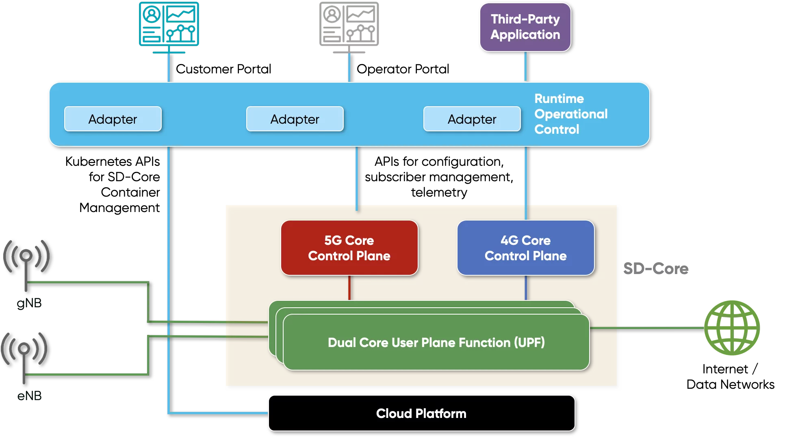
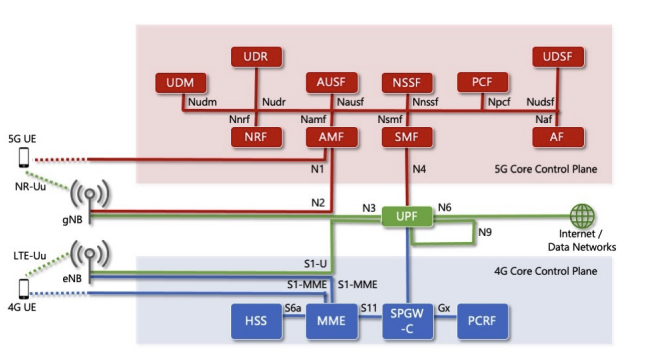

..
   SPDX-FileCopyrightText: © 2020 Open Networking Foundation <support@opennetworking.org>
   SPDX-License-Identifier: Apache-2.0

SD-Core as a Cloud Managed Service
==================================

    * SD-Core is a flexible, agile, scalable and configurable dual-mode 4G/5G core
      network platform that builds upon and enhances ONF’s OMEC and free 5GC core
      network platforms to support LTE, 5G NSA and 5G SA services.

    * The SD-Core control plane provides the flexibility of simultaneous supports
      for 5G standalone, 5G non-standalone and 4G/LTE deployments.

    * SD-Core provides a rich set of APIs to Runtime Operation Control (ROC).

        * Operators can use these APIs to provision the subscribers in the mobile core
          and their associated access and connectivity policies.
        * Control runtime configuration of network functions e.g. management of Network slices
        * ROC includes built-in adapters for SD-Core to translate its monitoring and configuration
          APIs to customer and operator portals as well as third-party applications with corresponding
          levels of abstraction. Third party applications can leverage telemetry data to create
          applications for closed loop control.

SD-Core Architecture
--------------------
SD-Core architecture enables the following distinct features:

    - All SD-Core components follow 3GPP standards to interface with others as well as the
      external networks and systems (e.g., RAN, communication services, etc.). As such,
      components can be consumed independently and be used as part of a multi-vendor
      mobile core deployment.
    - SD-Core’s 5G core control plane functions leverage seed code from the free5GC project,
      upon which the SD-Core community has implemented numerous architectural changes that
      are integrated and optimized with SD-Core’s set of UPF solutions along with several
      new features
    - The solution enables 4G, 5G Standalone (SA) and 5G Non-Standalone (NSA) connectivity.
    - The architecture is fully disaggregated, composed of containerized components. Helm charts are
      provided to deploy SD-Core on K8s cluster.
    - The platform is configurable in runtime via an extensible set of APIs.
    - The solution is consumable as a cloud-managed service.
    - All interfaces are designed to be robust in order to handle all network errors including but
      not limited to packet loss, peer network function failure, and duplicate packets.
    - SD-Core’s 4G Core is designed to have a CUPS (Control-User Plane Separation) compliant architecture and
      uses the 3GPP Packet Forwarding Control Protocol (PFCP) to implement CUPS
    - SD-Core’s 4G control plane has been enhanced to provide functional support for 5G Nonstandalone
      operation with compliant eNBs and gNBs as per 3GPP specifications. 5G NSA related enhancements
      include support of the extended bearer rates on required interfaces as well as the 5G NSA attributes
      in the HSS.

Multiple Distributed User Planes
--------------------------------

SD-Core has two User Plane Functions (UPFs) designed to be deployed throughout
the network edge. Each UPF is optimized to handle specific classes of application
and take advantage of various hardware acceleration options. Deployments can
intermix the UPF variants.

    * P4-Based UPF optimized for private enterprise deployments, and providing fine-grained
      visibility for verifiable performance and secure operations
    * Containerized Dual-Core UPF optimized for private enterprise deployments, capable of
      processing LTE and 5G traffic simultaneously

In SD-Core, a connected device is assigned to a UPF based on the network-wide slice configuration.
Specifically, in 5G core, the SMF uses the network slice information received in the user session
context as well as the Data Network Name (DNN) information received from AMF to select the serving
UPF. In the case of 4G core, the SPGW-C uses the the Access Point Name (APN) information to select
the serving UPF.

Network Slicing
---------------

Network slicing is one of the most important features of the 5G core network. Network
slicing helps in isolating the network for various business and use cases. In the disaggregated
service-based architecture of 5G core, this isolation may include only the UPF or also a subset
of the control plane services such as the SMF. However, mobile core control functions that
are responsible for managing user mobility, user authentication, and network slicing need
to remain centralized across all slices. SD-Core provides the necessary APIs to manage
network slices using external agents. ONF’s ROC, pre-integrated with SD-Core, allows for this
central management via portals as well as automation. If the management requires
instantiation of a new UPF and/or a new SMF instance, ROC oversees this by interacting with
edge cloud or hyperscale container management services to provision such new network
function instances.

Once all mobile core service instances are provisioned for a new slice, ROC uses SD-Core
APIs to configure the slice as well as all required central network functions. SD-Core provides
APIs to create and configure network slices and assign resources to each slice. Operators can
assign a slice for a group of users/devices based on the use case. The behavior of each slice
is configurable and can be dynamically changed during run time. SD-Core’s architecture
supports assigning dedicated network functions to a specific slice or providing logical
separation if network functions are to be shared among various slices. Various QoS and
access policies can be applied to each slice to control the assigned resources as well as IP
connectivity and access control within each slice.
Operators can create new slices based on criteria such as isolating devices allowed to access
specific packet data networks/edge applications or keeping all devices or flows with the
same QoS classification grouped under one slice. Network slice selection is achieved through
3GPP-specified network functions like Network Slice Selection Function (NSSF) and Network
Repository Function (NRF). NSSF helps in mapping the device/flow to a specific slice and
steering the device/flow traffic to the right set of core network elements. SD-Core’s 5G
implementation natively includes both NSSF and NRF for slice selection.
As described earlier, SD-Core’s P4-based dual-core UPF allows for the monitoring of all
4G/5G traffic with fine-grained granularity using INT. This effectively means that with the P4-
based dual-core UPF, it is possible to conduct per packet network monitoring to track
whether slice-specific SLAs are being met and automatically adapt network behavior by
changing per slice resource allocations, QoS priorities etc., to automatically sustain the
required network performance using closed-loop control.

SD-Core Deployment Options
--------------------------

The level of disaggregation and associated optimizations achieved for each component of
its 4G and 5G control plane makes SD-Core suitable for a wide variety of deployment
options. These optimizations include the capability for the 4G and 5G control planes to
oversee many UPFs, potentially instantiated at geographically diverse locations, as illustrated
It is possible to deploy all components of SD-Core collocated in an edge cloud or a central
cloud for private consumption. It is also possible to distribute the components of SD-Core
across multiple clouds, edge and central, to deliver a cloud-managed multi-tenant
connectivity service. In this distributed deployment option, SD-Core’s control plane will run
on a central/hyperscaler cloud and control multiple user planes running on different onpremises
edge clouds, potentially serving distinct customers as illustrated in Figure 8. In this
deployment, the 4G and 5G control plane functions can scale as necessary. Each customer
site can have more than one UPF deployed depending on the use cases and network slices
configured. Operators can also decide to deploy UPFs in the central cloud for certain
customers and their use cases where latency and data privacy is not a concern. SD-Core
brings the flexibility to define network slices for each customer in such a way that one
deploys a distinct UPF for each slice and instantiates the various components of the solution
at the customer edge or in the central cloud, as needed and best suited.

.. image:: ../_static/images/hybrid-cloud.png
  :width: 700px

SD-Core’s hybrid cloud deployment is an important enabler for a managed 4G/5G
connectivity service where each customer site may be deployed to serve a different set of
use cases and may have different types of underlying cloud environments. The 4G/5G core
control planes running on the central cloud have been designed and optimized to support
distributed edge sites which are spread across different locations across the world. The
SD-Core control plane uses PFCP to communicate with the UPFs at the edge sites. The hybrid
cloud deployment architecture has been optimized to handle variability in encountered
delays communicating with the remote edge sites and is equipped to handle potential
packet losses and retransmissions to support a multi-tenant, distributed geography
deployment.

Architecture Diagram of SD-Core 4G block
----------------------------------------
- show configPod, config distribution, Cassandra DB, SIMApp, 4G network Functions

Architecture Diagram of SD-Core 5G block
----------------------------------------
- show configPod, config distribution, MongoDB, SIMApp, 5G network functions

Configuration Distribution Architecture
---------------------------------------
- how grpc, rest is used to distribute the configuration

