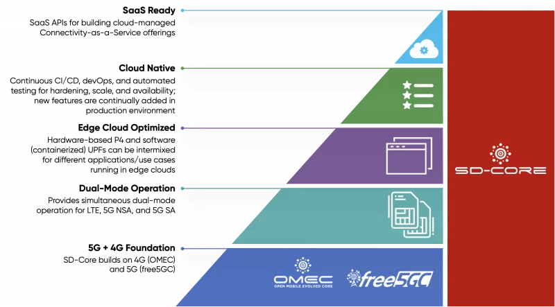
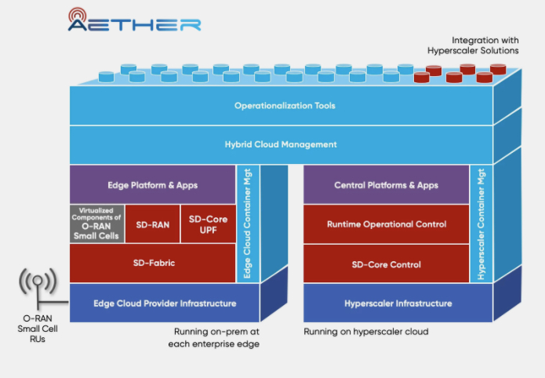

..
   SPDX-FileCopyrightText: © 2020 Open Networking Foundation <support@opennetworking.org>
   SPDX-License-Identifier: Apache-2.0

Introduction
============

SD-Core™ is the Open Networking Foundation™ (ONF)'s open source, flexible, agile,
scalable, and configurable dual-mode 4G/5G mobile core network solution that enables a
cloud-based Connectivity-as-a-Service. SD-Core builds on and enhances ONF's 4G Open
Mobile Evolved Core (OMEC)™ as well as the free5GC© core network platform to create a
dual-mode solution that supports LTE, 5G NSA and 5G SA services optimized for hybrid-cloud
environments.

Its centralized dual-mode mobile core control plane has been designed to control many UPFs
distributed across many edge clouds around the world. This makes SD-Core the ideal open
source platform to offer cloud-based Private 4G/5G connectivity services to enterprises
as an enabler for Industry 4.0 transformation.

SD-Core provides a rich set of APIs for runtime configurability of each of its services, as well
as supporting subscriber management via third party applications. These APIs provide
extensive telemetry capabilities that enable monitoring, logging, and alerts, with integrated
verification and closed-loop control solutions. With operator and customer facing portals,
SD-Core can be configured for dynamically programmable network slicing, subscriber, QoS
and policy management, providing precise access control for users, devices, data networks
and edge applications.

Key Capabilities
----------------

SD-Core provides the following core capabilities:

- Ensure only authenticated mobile devices have network access
- Provide IP connectivity for data and voice services
- Enforce QoS and network slice policies
- Track user mobility to ensure uninterrupted service
- Monitor and track subscriber usage

SD-Core uses OMEC and free5GC as baseline components, integrates the two for dual-mode operation, and provides
significant new functionality to optimize delivery of Connectivity-as-a-Service from the
hybrid cloud. It is of course also possible to use SD-Core to provide 4G-only, or 5G-only
connectivity using standard 3GPP interfaces.

In order to optimize for the hybrid cloud and to support emerging Industry 4.0 use cases,
SD-Core includes multiple user plane functions (UPFs) to handle different classes of
enterprise traffic:

- **Software-based UPF**: Provides high performance and scalability by leveraging acceleration
  technologies like DPDK, suitable for handling large numbers of devices and flows.

SD-Core is an Integral Part of Aether
--------------------------------------

SD-Core serves as an integral component of Aether, ONF's 5G Connected Edge platform
for private mobile connectivity and edge cloud services. Key integration points include:

- SD-Core provides the 4G/5G connectivity layer
- The SD-Core control plane at the central site manages multiple user plane components
  distributed across Aether Edge sites

