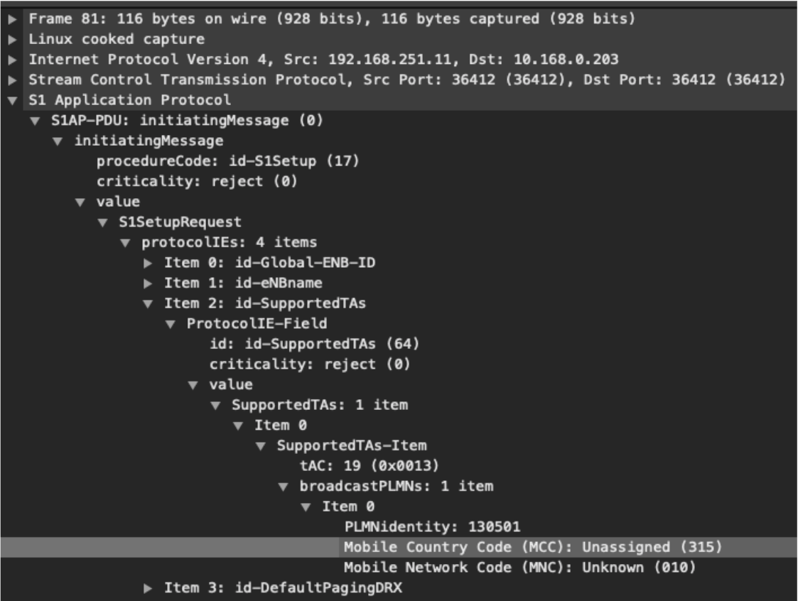
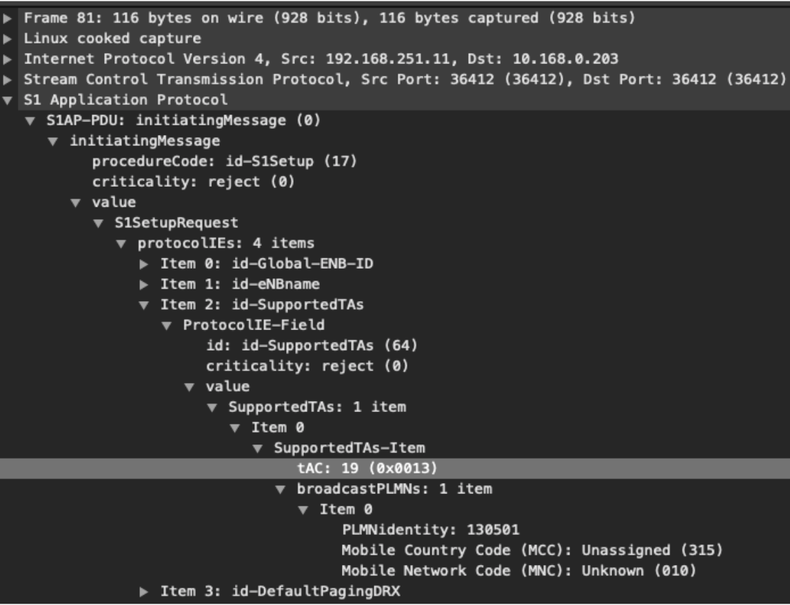
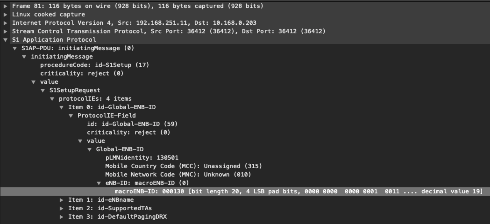

..
   SPDX-FileCopyrightText: © 2020 Open Networking Foundation <support@opennetworking.org>
   SPDX-License-Identifier: Apache-2.0

Acceptance Specification
========================

Objectives
----------

The purpose of this document is to create an end-user test object list (TOL)
for Aether Connected Edge (ACE).

This document will focus on the connectivity services end-user testing.  In the
future, this document will extend to other services offered through ACE.

The Automated continuous testing framework for the platform is out of the scope of this document.

Integration Test (eNB-LTE Core)
-------------------------------

Before we start to test End-to-End connectivity, we have to check the
connection (called S1-MME/S1-C interface) between eNB in an edge and MME in a
public cloud.

In order to verify this connectivity, the following test cases should be passed.

Note that all the following test/verification cases have some assumptions:

1. eNB is connected to the Fabric switch;
2. eNB has correct network configurations;
3. eNB has correct ID configurations provided by the ONF PMFE team.

IT-TOL01 Fabric Test 1: the connectivity test within the edge
^^^^^^^^^^^^^^^^^^^^^^^^^^^^^^^^^^^^^^^^^^^^^^^^^^^^^^^^^^^^^

In order to test the fabric test, please see the following steps:

+----------------------------------------------+------------------------------------+
|Steps                                         |Expected Outcome                    |
+----------------------------------------------+------------------------------------+
|1. Access to the eNB* (through SSH or Web GUI)|Able to get ICMP reply(PING reply)  |
|                                              |from the GCP node.                  |
|                                              |                                    |
|2. Ping to "10.168.0.6" eNB S1-MME/S1-C       |( )YES  ( )NO                       |
|   interface IP address*                      |                                    |
|                                              |Comments:                           |
+----------------------------------------------+------------------------------------+

.. note::
   it depends on the eNB device. Some eNBs have a single network interface for the management network, S1-U, and S1-C,
   while other eNBs have separate interfaces. The former eNB type has a single IP address,
   and the later eNB type has multiple IP addresses for each interface.

IT-TOL02 Fabric Test 2: the connectivity test between the eNB and the public cloud
^^^^^^^^^^^^^^^^^^^^^^^^^^^^^^^^^^^^^^^^^^^^^^^^^^^^^^^^^^^^^^^^^^^^^^^^^^^^^^^^^^

In order to test the fabric test, please see the following steps:

+----------------------------------------------+------------------------------------+
|Steps                                         |Expected Outcome                    |
+----------------------------------------------+------------------------------------+
|1. Access to the eNB* (through SSH or Web GUI)|Able to get ICMP reply(PING reply)  |
|                                              |from the GCP node.                  |
|                                              |                                    |
|2. Ping to "10.168.0.6"                       |( )YES   ( )NO                      |
|                                              |                                    |
|                                              |Comments:                           |
+----------------------------------------------+------------------------------------+

.. note::
   it also depends on the eNB device. Some eNBs allow us to SSH into their device, other eNBs provide the PING tool through Web GUI.
   Of course, some eNBs do not support both. In that case, it is okay to skip this test case.

IT-TOL03 SCTP Connection Verification
^^^^^^^^^^^^^^^^^^^^^^^^^^^^^^^^^^^^^

In order to verify the SCTP connection between MME and eNB, please see the following steps:

+----------------------------------------------+------------------------------------+
|Steps                                         |Expected Outcome                    |
+----------------------------------------------+------------------------------------+
|1. SSH to the gateway device* for the eNB     |Able to see Heart Beat              |
|   S1-MME/S1-C traffic                        |messages                            |
|                                              |                                    |
|2. Capture the traffic with Wireshark         |( )YES    ()NO                      |
|   or the command: `sudo tcpdump -i any sctp` |                                    |
|                                              |Comments:                           |
+----------------------------------------------+------------------------------------+

Capture the traffic with Wireshark or the command: `sudo tcpdump -i any sctp`

.. note::
   the eNB should have the gateway IP address for the S1-MME/S1-C traffic.
   You can SSH there with the gateway IP address in the eNB and capture the traffic.
   Normally, the gateway device can be one of those devices: (i) VPN router; (ii) Firewall device in between VPN router and the edge;
   (iii) one of edge servers.

IT-TOL04 PLMN Verification
^^^^^^^^^^^^^^^^^^^^^^^^^^

In order to verify the TAC number, please see the following steps:

Able to see the correct MCC and MNC values*

+-------------------------------------------------+------------------------------------+
|Steps                                            |Expected Outcome                    |
+-------------------------------------------------+------------------------------------+
|1. SSH to the gateway device for the eNB         |Able to see the correct MCC and MNC |
|   S1-MME/S1-C traffic                           |values                              |
|                                                 |                                    |
|2. Start to capture the traffic with Wireshark   |( )YES    ()NO                      |
|   or the command: `sudo tcpdump -i any sctp     |                                    |
|   -w FileName.pcap`                             |Comments:                           |
|3. Reboot eNB                                    |                                    |
|                                                 |                                    |
|4. Wait until FileName.pcap has `S1SetupRequest` |                                    |
|   S1SetupResponse messages                      |                                    |
|                                                 |                                    |
|5. Stop the packet capturing and open            |                                    |
|   the FileName.pcap                             |                                    |
|                                                 |                                    |
|6. Find out the S1SetupRequest message and       |                                    |
|   open the detailed packet information          |                                    |
|                                                 |                                    |
|7. Go to "Item 2: id-SupportedTAs"  section      |                                    |
|   and check "MACC and "MNC" values              |                                    |
+-------------------------------------------------+------------------------------------+

Example (the MCC is 315 and MNC is 010)

IT-TOL05 TAC Number Verification
^^^^^^^^^^^^^^^^^^^^^^^^^^^^^^^^

+-------------------------------------------------+------------------------------------+
|Steps                                            |Expected Outcome                    |
+-------------------------------------------------+------------------------------------+
|1. SSH to the gateway device for the eNB         |Able to see the correct TAC number  |
|   S1-MME/S1-C traffic                           |                                    |
|                                                 |                                    |
|2. Start to capture the traffic with Wireshark   |( )YES    ()NO                      |
|   or the command: `sudo tcpdump -i any sctp     |                                    |
|   -w FileName.pcap`                             |Comments:                           |
|3. Reboot eNB                                    |                                    |
|                                                 |                                    |
|4. Wait until FileName.pcap has `S1SetupRequest` |                                    |
|   S1SetupResponse messages                      |                                    |
|                                                 |                                    |
|5. Stop the packet capturing and open            |                                    |
|   the FileName.pcap                             |                                    |
|                                                 |                                    |
|6. Find out the S1SetupRequest message and       |                                    |
|   open the detailed packet information          |                                    |
|                                                 |                                    |
|7. Go to "Item 0: id-SupportedTAs" section       |                                    |
|   and check TAC "                               |                                    |
+-------------------------------------------------+------------------------------------+

.. note::
   if you already captured packets in IT-TOL03, you can skip steps from 1 to 5.
   Just you can check the expected outcome with the file you captured at IT-TOL03.

Example (the TAC number is 19)

IT-TOL06 eNB Verification
^^^^^^^^^^^^^^^^^^^^^^^^^

In order to test the eNB, please see the following steps:

+-------------------------------------------------+------------------------------------+
|Steps                                            |Expected Outcome                    |
+-------------------------------------------------+------------------------------------+
|1. SSH to the gateway device for the eNB         |Able to see the correct eNBID       |
|   S1-MME/S1-C traffic                           |                                    |
|                                                 |                                    |
|2. Start to capture the traffic with Wireshark   |( )YES    ()NO                      |
|   or the command: `sudo tcpdump -i any sctp     |                                    |
|   -w FileName.pcap`                             |Comments:                           |
|3. Reboot eNB                                    |                                    |
|                                                 |                                    |
|4. Wait until FileName.pcap has `S1SetupRequest` |                                    |
|   S1SetupResponse messages                      |                                    |
|                                                 |                                    |
|5. Stop the packet capturing and open            |                                    |
|   the FileName.pcap                             |                                    |
|                                                 |                                    |
|6. Find out the S1SetupRequest message and       |                                    |
|   open the detailed packet information          |                                    |
|                                                 |                                    |
|7. Go to "Item 0: id-Global-eNB-ID" section      |                                    |
|   and check "eNB-ID: macroENB-ID"               |                                    |
+-------------------------------------------------+------------------------------------+

.. note::
   if you already captured packets in IT-TOL03, you can skip steps number 1 to 5.
   Just you can check the expected outcome with the file you captured at IT-TOL03.

Example (the eNB ID is 19)

Connectivity Services
---------------------

Aether provides only data connectivity for end-user devices and systems.
So the voice service over LTE is not available. However, users can use
any OTT services over the Aether network for voice connectivity.

The test specifications are only covering the data connectivity focused tests.

CS-TOL01 Device Attach/Connect
^^^^^^^^^^^^^^^^^^^^^^^^^^^^^^

To test device can attach to Aether network

+----------------------------------------------+------------------------------------+
|Steps                                         |Expected Outcome                    |
+----------------------------------------------+------------------------------------+
|1. Turn off the mobile device                 |Able to attach the device and       |
|                                              |connect to the internet/Aether      |
|2. Turn on the mobile device                  |Network                             |
|                                              |                                    |
|3. Check whether the device is showing        |( )YES  ( )NO                       |
|   connected on the status, depending on      |                                    |
|   the device it will show "Aether" or        |                                    |
|   "MCCMNC" format.                           |                                    |
|4. Browse https://www.google.com/?             |( )YES  ( )NO                       |
|   From the device web browser                |                                    |
|                                              |Comments:                           |
+----------------------------------------------+------------------------------------+

CS-TOL02 Device Detach/Disconnect
^^^^^^^^^^^^^^^^^^^^^^^^^^^^^^^^^

To test device can detach/disconnected by user initiation

+----------------------------------------------+------------------------------------+
|Steps                                         |Expected Outcome                    |
+----------------------------------------------+------------------------------------+
|1. Make sure the device is connected to Aether|Able to detach the device and       |
|                                              |disconnect from the internet/Aether |
|2. Deselect the network (or forget the network|Network                             |
|   , depending on device configuration)       |                                    |
|3. Try to browse https://www.google.com/?      |( )YES  ( )NO                       |
|   From your web browser                      |                                    |
|                                              |Comments:                           |
+----------------------------------------------+------------------------------------+

CS-TOL03 Bandwidth Test - Internet
^^^^^^^^^^^^^^^^^^^^^^^^^^^^^^^^^^

To test bandwidth available to a mobile device over Aether network.

Please note the following, the bandwidth test depends on the eNB hardware,
your local breakout bandwidth, and the overall radio environment.
If you face an unexpected result, please explain it in the comment section in the outcome column.

+----------------------------------------------+------------------------------------+
|Steps                                         |Expected Outcome                    |
+----------------------------------------------+------------------------------------+
|1. Open Speedtest app from your mobile device |Expected Bandwidth/Throughput       |
|                                              |observed                            |
|                                              |                                    |
|2. Run Speedtest 3 times, take the average as |( )YES  ( )NO                       |
|   the final result                           |                                    |
|                                              |Comments:                           |
+----------------------------------------------+------------------------------------+

CS-TOL04 Bandwidth Test - Edge Application
^^^^^^^^^^^^^^^^^^^^^^^^^^^^^^^^^^^^^^^^^^

To test bandwidth available to a mobile device over Aether network.

Please note the following, the bandwidth test depends on the eNB hardware,
your local breakout bandwidth, and the overall radio environment. If you face an unexpected result,
please explain it in the comment section in the outcome column.

+----------------------------------------------+------------------------------------+
|Steps                                         |Expected Outcome                    |
+----------------------------------------------+------------------------------------+
|1. Initiate FTP Download from a local server  |Expected Bandwidth/Throughput       |
|   (same location) connected to the enterprise|observed                            |
|   network (through local breakout)           |                                    |
|                                              |                                    |
|2. Download 3 times, take the average as the  |( )YES  ( )NO                       |
|   final result                               |                                    |
|                                              |Comments:                           |
+----------------------------------------------+------------------------------------+

Monitoring Services
-------------------

ACE uses the Grafana dashboard for monitoring services.
Each ACE will be provided with Read-Only Access to our centralized monitoring platform.

Application Services
--------------------

Aether uses Rancher to onboard applications to ACE.
Each ACE host will be provided with access to rancher to onboard applications on their ACE cluster.

